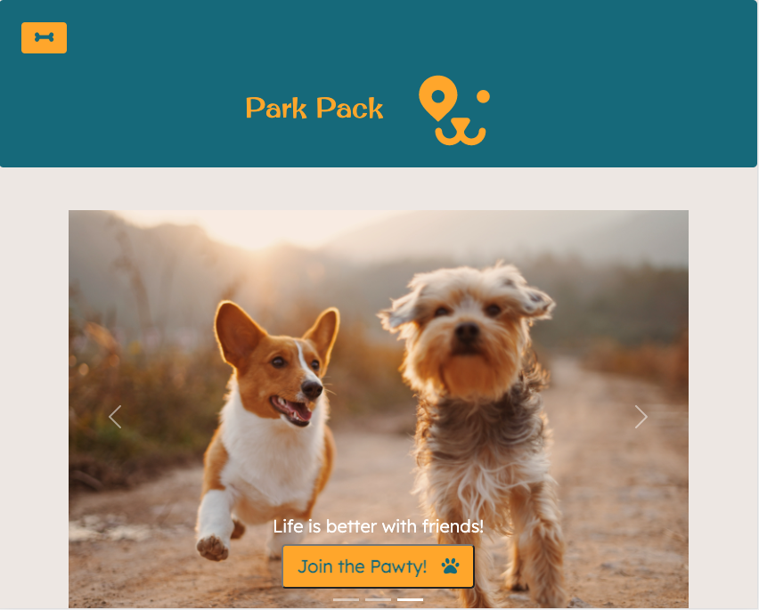

   

# 
 **PARK PACK** 

--- 

--- 

## **Table Of Contents** 

---

1. [Description](#description)
2. [Installation](#installation)
3. [Usage](#usage)
4. [Contributing](#contributing)
5. [Review and Contribute](#github)

--- 

## 
  **Description** 
 

--- 

This app is a social media site...FOR DOGGOS!  Create a profile for your dog, cute picture included, and scroll through other users to create friendships.  There is even a built in chat application so a client can plan out a doggy date!

--- 
 
## 
  **Installation** 

--- 
 
PARK PACK lives on Heroku.  <ol>
<li>If you would like to download it locally, clone the repo and run `npm i`.  This will install all dependencies</li>
<li>Next, you will have to initialize the mysql database</li>
<li>Once initialized input `npm run seed` in order to seed the database with test data, this will ease testing</li>
<li>Once seeded, you will need to initialize the app in the command line with `npm start` </li>
<li>In the command line note which port the server is being run on and input `localhost:{givenPORT}` in the browser</li>
</ol>
--- 

## 
  **Usage** 

---

||

--- 
<ol>
<li>First, create a user profile.</li>
<li>Once that is created you can start dishing about your doggo.</li>
<li>Add a picture along with other info about your dog which makes it easier for us to connect you with other dogs and owners for fun adventures!</li>
<li> From the dashboard the user can select other dog profiles to add to your pack.</li>  
<li>Once friendships are initiated, you can view your pack from the side scrolling menu.</li>
<li>Take advantage of the native chat app in order to set up adventures for your pups!</li>
</ol>

---

--- 

## 
  **Contributing** 

--- 

### License is attached, if you would like to contribute simply fork the repo.  Some things in the works!
<ul>
   <li>Working on making direct messaging available.</li>
   <li>Making more unique friend suggestions taylored to the user with data collected from dog profile</li>
   <li>Map integration into meetups</li>
   <li>Removing naughty puppies from ones pack</li>
</ul>

--- 

## 
  **Github, Email, and Deployments** 

--- 

<ul>
   <li>

### _Github:_ [Athear/park-pack](https://github.com/Athear/park-pack)
</li>
<li>

### _Email:_ parkpack0@gmail.com
</li>
<li>

### _Heroku:_ https://park-pack.herokuapp.com/
</li>
</ul>

---